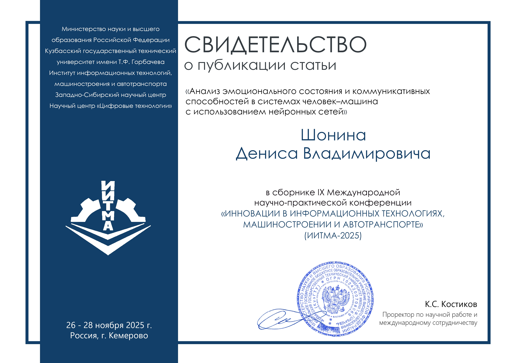

# Научная статья и акселератор

По данной теме была опубликована научная статья:

Также был проведен акселератор, где проект был представлен и оценен жюри. Вы можете ознакомиться с результатами по следующей [ссылке](https://pt.2035.university/project/edika_2025_10_14_15_06_12). 

Сертификат о участии в акселераторе доступен по [ссылке](ссылка_на_сертификат).

## Другие научные статьи, опубликованные в этом году:

1. **Шонин Д.В., Джамалова К.В., Гаспарян Э.А., Зимин Г.Д.**  
   *Интеграция омниканальных технологий в электронный документооборот*.  
   Вестник Вологодского государственного университета. Серия: Технические науки. 2025. № 4 (30). С. 39-42.

2. **Орлов В.О., Гаспарян Э.А., Шонин Д.В.**  
   *Автоматизированное распределение заявок по воронкам на основании входящих данных*.  
   В сборнике: Проблемы управления в социально-экономических и технических системах. Материалы XXI Международной научно-практической конференции. В 2-х томах. Саратов, 2025. С. 397-400.

3. **Шонин Д.В., Гаспарян Э.А., Орлов В.О., Михеев А.С.**  
   *Сервисы для генерации документов и работы с документооборотом с применением искусственного интеллекта*.  
   В сборнике: Проблемы управления в социально-экономических и технических системах. Материалы XXI Международной научно-практической конференции. В 2-х томах. Саратов, 2025. С. 471-474.

4. **Кулагин И.М., Гаспарян Э.А., Бутков А.А., Шонин Д.В.**  
   *Оптимизация процесса доставки изменений для мобильного приложения*.  
   Вестник Вологодского государственного университета. Серия: Технические науки. 2025. № 3 (29). С. 45-47.
