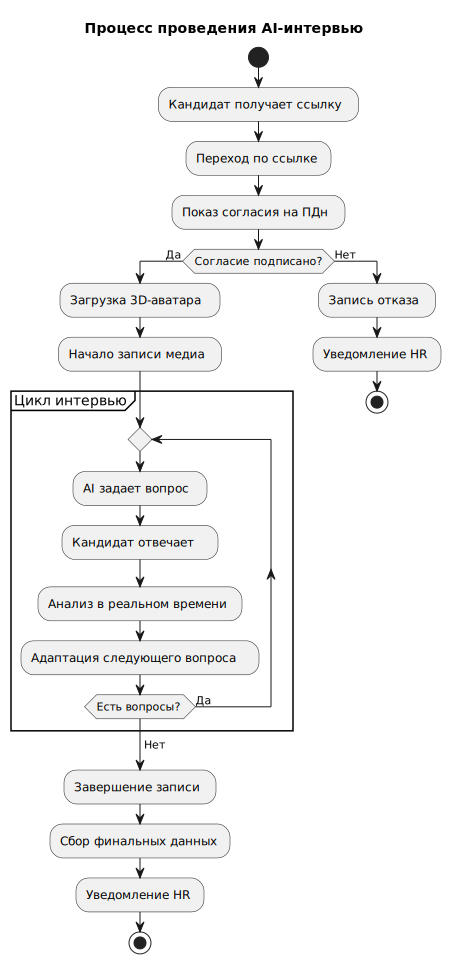
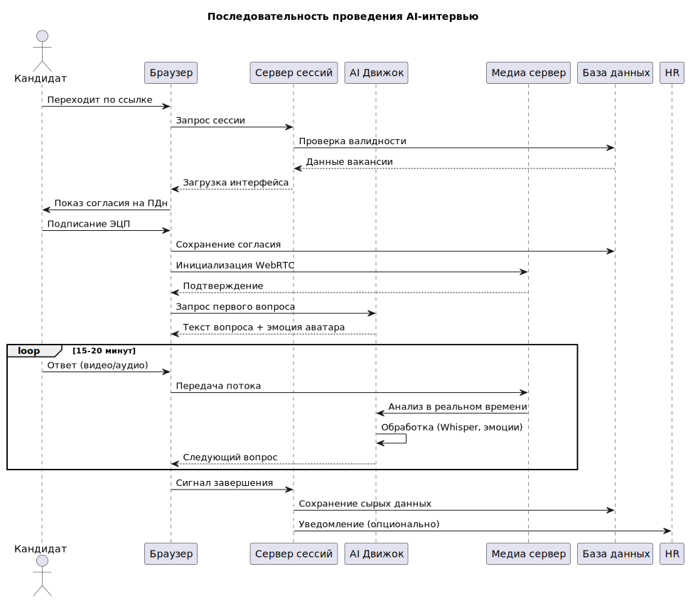
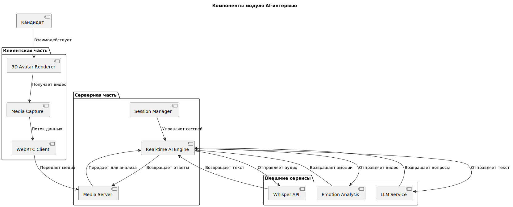
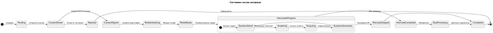

## Организация и проведение AI-интервью

## 1.1 Use Case Diagram

## 1.2 Activity Diagram

## 1.3 Sequence Diagram

## 1.4 Class Diagram (структура данных сессии)

## 1.5 Component Diagram (архитектура компонентов)

## 1.6 State Diagram (жизненный цикл сессии)
