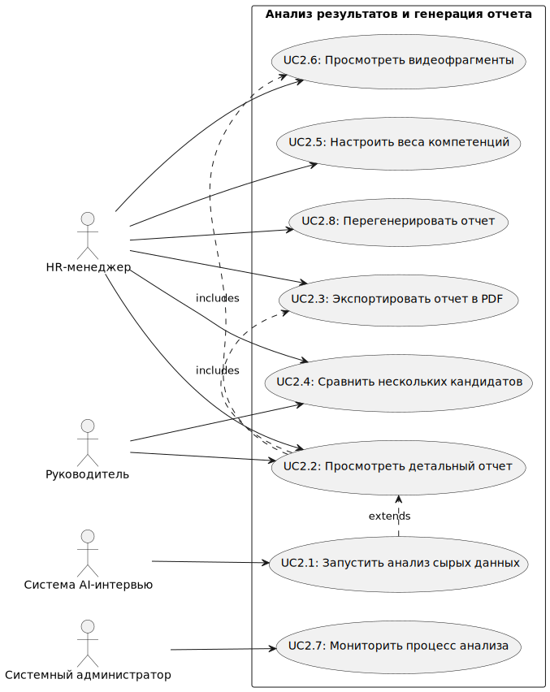
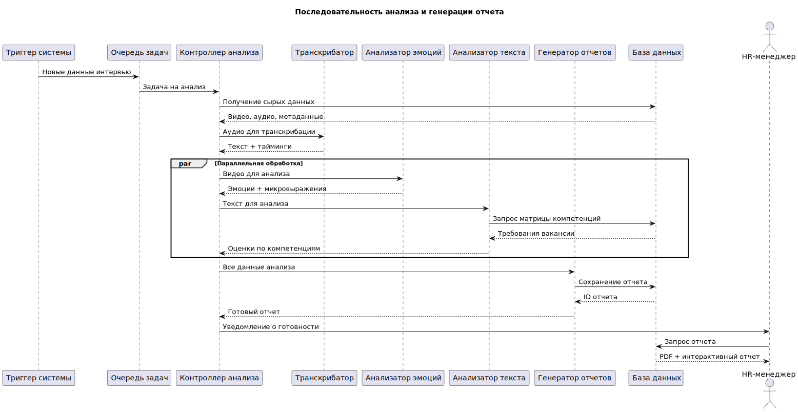
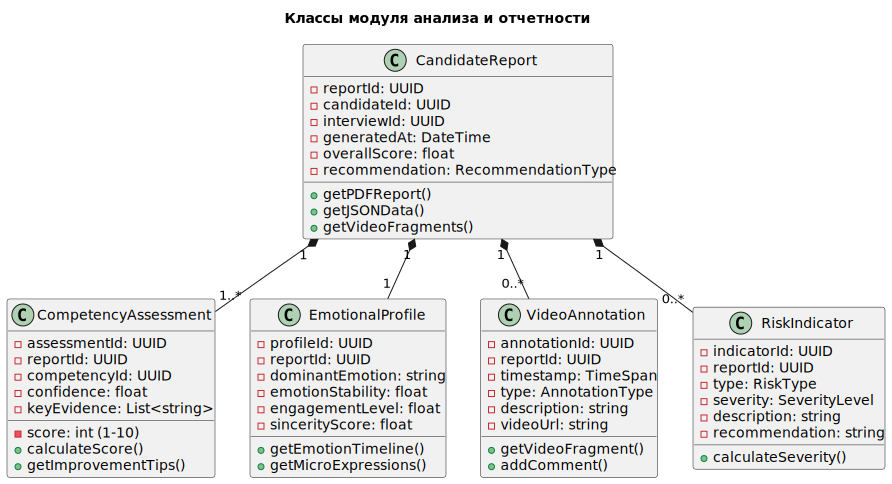
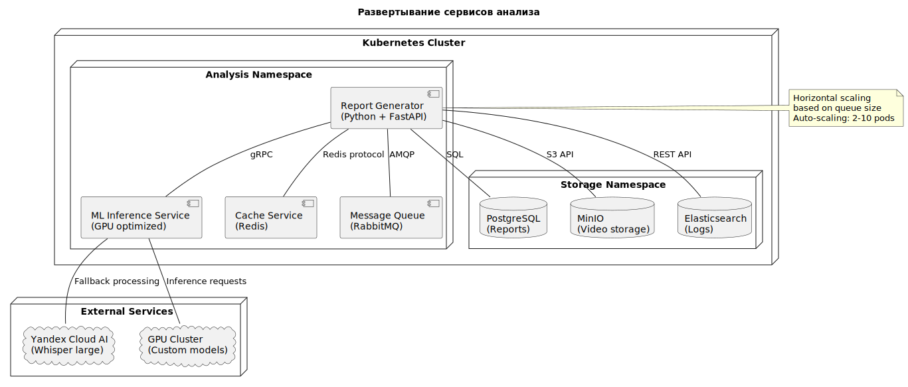
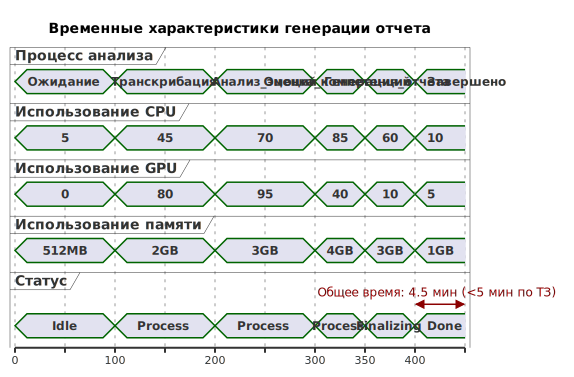

## Анализ результатов и генерация отчета

## 2.1 Use Case Diagram

## 2.2 Activity Diagram

## 2.3 Sequence Diagram

## 2.4 Class Diagram (модель данных отчета)

## 2.5 Deployment Diagram (развертывание сервисов)

## 2.6 Timing Diagram (временные характеристики)
