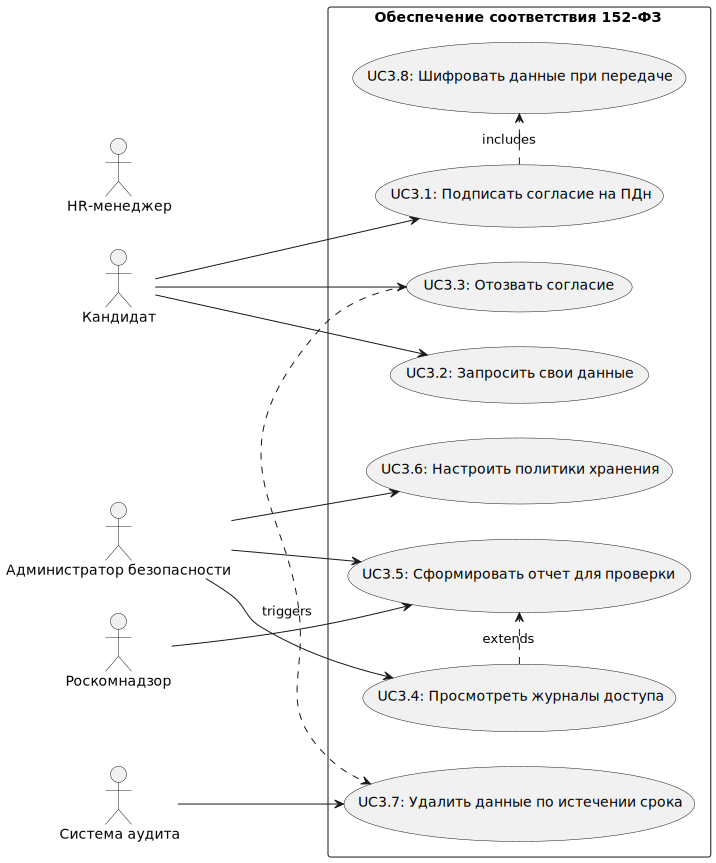
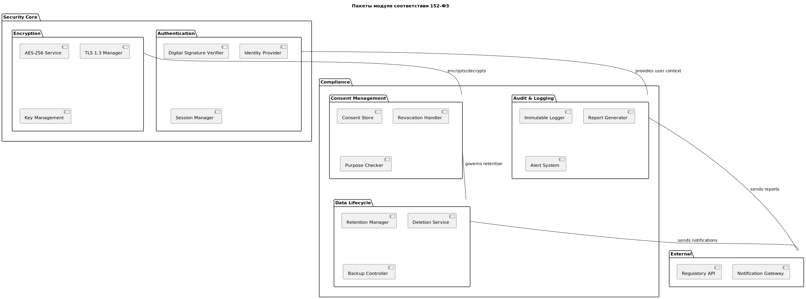
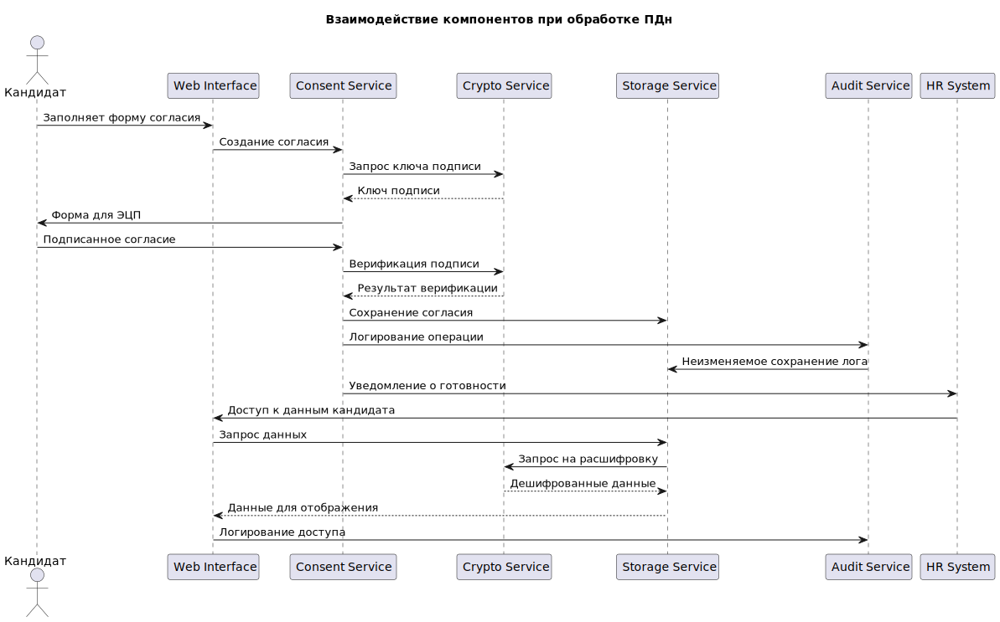

## Обеспечение соответствия 152-ФЗ

## 3.1 Use Case Diagram

## 3.2 Activity Diagram

## 3.3 Sequence Diagram

## 3.4 Class Diagram (модель безопасности)

## 3.5 Package Diagram (структура модулей безопасности)

## 3.6 Communication Diagram
