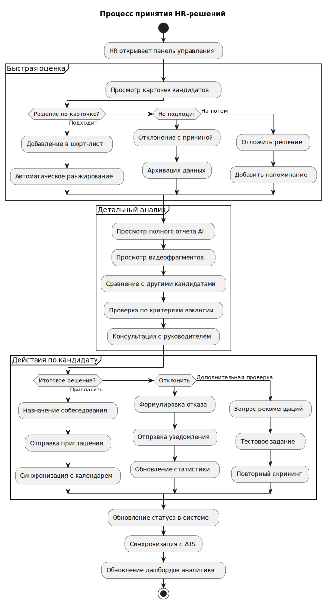
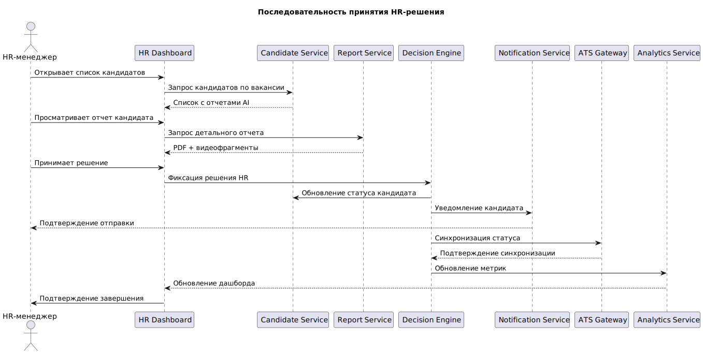
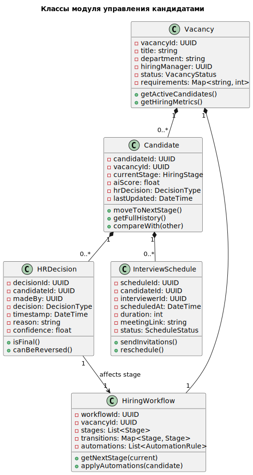
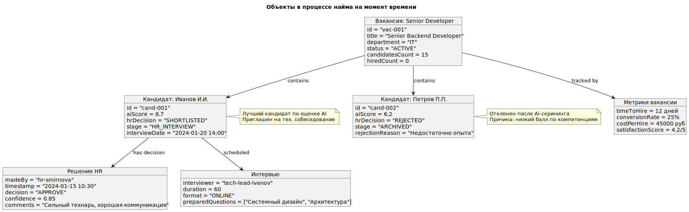

## Управление кандидатами и HR-решения

## 4.1 Use Case Diagram

## 4.2 Activity Diagram

## 4.3 Sequence Diagram

## 4.4 Class Diagram (модель workflow)

## 4.5 Component Diagram (архитектура HR-интерфейса)

## 4.6 Object Diagram (состояние системы)
